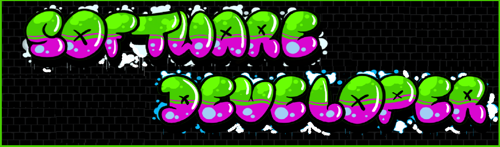

  

<h1 align="center">Hi 👋, I'm Zach</h1>
<h3 align="center">A passionate full stack developer from Denver, Colorado</h3>
 
🔭 I’m currently working on [Angular/Mean Course](https://github.com/zmunson85/AngularPractice)

🌱 I’m currently learning **Mean Stack**

⚡ Fun fact **You will sleep 1/3 of your life away!**

&nbsp;

  

<h3 align="left">Connect with me:</h3>

  

<h3 align="left">Languages and Tools:</h3>

                               

<h3 align="left">Support:</h3>

  
